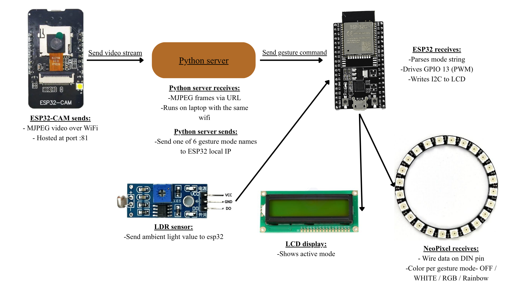
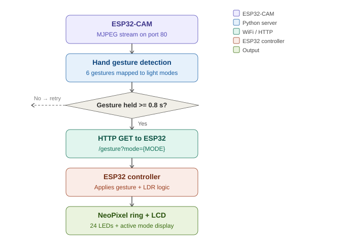
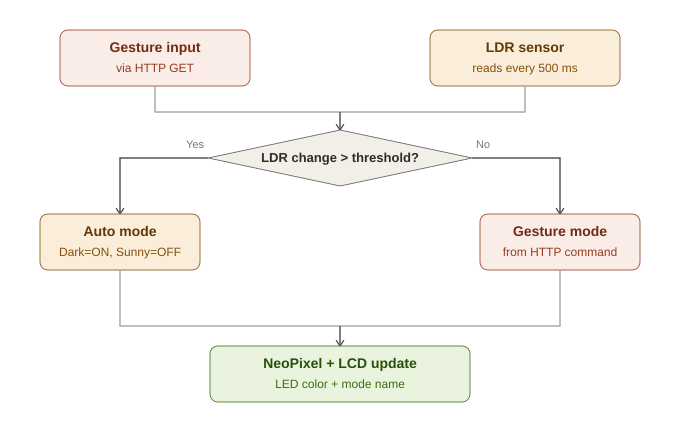

# LightControl — Touchless RGB Lighting via Hand Gesture Recognition

> IoT Final Project &nbsp;|&nbsp; Group 9  
> Members: **Heng SiengE**, **Somang Sochannimol**, **Tak Sreytim**

---

## Demo video

[](https://youtu.be/oJV86cBj-a0?si=2AtGCzmkG3IqKGtB)

▶️ [Watch on YouTube](https://youtu.be/oJV86cBj-a0?si=2AtGCzmkG3IqKGtB)

---

## Project overview

LightControl is a touchless RGB lighting system that uses an **ESP32-CAM** to stream live video to a **Python server** running **MediaPipe** for real-time hand gesture recognition. Based on the detected gesture, a second **ESP32 microcontroller** controls a **24-LED NeoPixel ring** and updates an **LCD display** with the active mode — all communicated over WiFi via HTTP.

An **LDR sensor** adds a second layer of intelligence: if ambient light changes significantly, the system automatically overrides the gesture command to save power or ensure visibility.

---

## System architecture



---

## Flowcharts

### Gesture detection pipeline



### ESP32 controller decision logic



---

## Hardware components

| # | Component | Role |
|---|-----------|------|
| 1 | ESP32-CAM (AI Thinker) | Captures and streams live MJPEG video over WiFi |
| 2 | ESP32 (controller) | Receives HTTP commands, reads LDR, drives outputs |
| 3 | NeoPixel ring — 24 LEDs | Visual output: gesture-mapped colors and effects |
| 4 | LCD display (I2C 16×2) | Shows active gesture mode and device status |
| 5 | LDR sensor | Measures ambient brightness for auto light adjustment |

### Pin mapping (ESP32 controller)

| GPIO | Component |
|------|-----------|
| 13 | NeoPixel ring data line |
| 34 | LDR sensor analog input |
| 21 | I2C SDA — LCD |
| 22 | I2C SCL — LCD |

---

## Gesture classes and LED mapping

| Gesture | Hand shape | LED effect | LCD display |
|---------|-----------|-----------|-------------|
| Fist | All fingers closed | All LEDs off | `Mode: OFF` |
| Open hand | All 5 fingers up | Full white | `Mode: WHITE` |
| One finger | Index only | Solid red | `Mode: RED` |
| Peace sign | Index + middle | Solid green | `Mode: GREEN` |
| Three fingers | Thumb + index + pinky | Solid blue | `Mode: BLUE` |
| Call sign | Thumb + pinky only | Rainbow cycle | `Mode: RAINBOW` |

---

## Decision logic

This project satisfies the combined camera + sensor requirement through the following logic:

```
IF LDR change > hysteresis threshold (150):
    IF ambient = DARK  → force AUTO-ON  (white LEDs, full brightness)
    IF ambient = SUNNY → force AUTO-OFF (LEDs off, power save)
    reset manualOverride = false

ELSE (LDR stable):
    apply gesture command received via HTTP
    set manualOverride = true
```

LDR thresholds (12-bit ADC, range 0–4095):

| Value | Condition | Action |
|-------|-----------|--------|
| < 800 | Sunny / bright | Auto OFF |
| > 3000 | Dark | Auto ON |
| 800–3000 | Normal | Gesture control active |

---

## Setup and how to run

### Requirements

Install Python dependencies:

```bash
pip install mediapipe==0.10.11 opencv-python requests
```

Arduino libraries needed:
- `Adafruit NeoPixel`
- `LiquidCrystal_I2C`

---

### Step 1 — Flash the ESP32-CAM

1. Open `esp32cam_stream.ino` in Arduino IDE
2. Set your WiFi credentials:
```cpp
const char* WIFI_SSID = "YOUR_SSID";
const char* WIFI_PASS = "YOUR_PASSWORD";
```
3. Select board: **AI Thinker ESP32-CAM**
4. Upload → open Serial Monitor at **115200 baud**
5. Note the printed IP:
```
Stream URL: http://192.168.x.x/stream
```

---

### Step 2 — Flash the ESP32 controller

1. Open `esp32_controller.ino` in Arduino IDE
2. Set the same WiFi credentials (must be on the same network as the CAM)
3. Upload → open Serial Monitor at **115200 baud**
4. Note the printed IP:
```
Controller IP: 192.168.x.x
```

---

### Step 3 — Run the Python gesture server

1. Open `gesture_server.py` and update both IPs:
```python
ESP32_CAM_URL = "http://192.168.x.x/stream"   # from Step 1
ESP32_CTRL_IP = "http://192.168.x.x"           # from Step 2
```
2. Run:
```bash
python gesture_server.py
```
3. A window opens showing the live camera feed with hand skeleton overlay

---

### Step 4 — Use it

- Show your hand to the camera
- Hold a gesture steady for **0.8 seconds** to trigger it
- The NeoPixel ring and LCD update in real time

---
