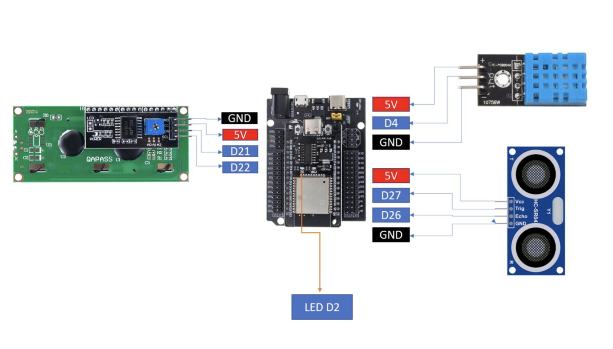
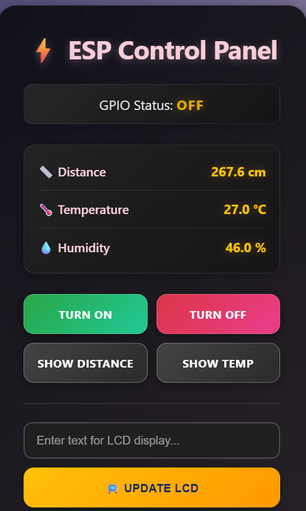
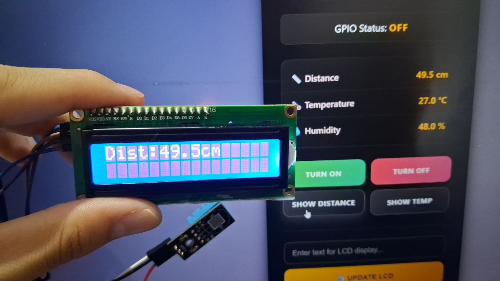
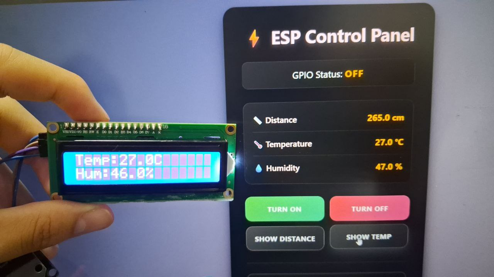

# LAB2: IoT Webserver with LED, Sensors, and LCD Control

## Overview

This project implements an ESP32-based IoT system with MicroPython that integrates a web interface and an LCD display. The system allows users to control an LED, read sensor data (temperature, humidity, and distance), and send custom messages to the LCD through a web server.

---

## Wiring Diagram

Below is the wiring configuration for connecting all components to the ESP32:



### Pin Connections:

| Component | ESP32 Pin | Description |
|-----------|-----------|-------------|
| **LCD (I²C)** | SDA → GPIO 21 | I²C Data Line |
| | SCL → GPIO 22 | I²C Clock Line |
| | VCC → 5V | Power Supply |
| | GND → GND | Ground |
| **DHT11 Sensor** | Data → GPIO 4 | Temperature & Humidity Data |
| | VCC → 5V | Power Supply |
| | GND → GND | Ground |
| **HC-SR04 Ultrasonic** | Trig → GPIO 27 | Trigger Pin |
| | Echo → GPIO 26 | Echo Pin |
| | VCC → 5V | Power Supply |
| | GND → GND | Ground |
| **LED** | GPIO 2 | Built-in LED on ESP32 |

---

## Setup Instructions

### 1. Hardware Setup
Connect all components according to the wiring diagram above. Ensure:
- All power (5V) and ground (GND) connections are secure
- I²C LCD is connected to GPIO 21 (SDA) and GPIO 22 (SCL)
- DHT11 data pin is connected to GPIO 4
- HC-SR04 trigger and echo pins are connected to GPIO 27 and GPIO 26
- I²C LCD address is set to 0x27 (default)

### 2. Software Setup

#### Upload Required Files
1. **Upload `main.py`** - Main program code

You can upload file using Thonny IDE.

#### Configure Wi-Fi
Open `main.py` and update your Wi-Fi credentials on lines 10-11:

```python
ssid = 'YOUR_WIFI_SSID'
password = 'YOUR_WIFI_PASSWORD'
```

Replace `YOUR_WIFI_SSID` and `YOUR_WIFI_PASSWORD` with your actual Wi-Fi network name and password.

### 3. Running the Server

1. Connect ESP32 to your computer via USB
2. Open Thonny IDE
3. Run the `main.py` file 
4. Wait for the message **"Connection successful"** in the console
5. Note the IP address displayed (e.g., `192.168.1.100`)
6. Open a web browser on any device connected to the same Wi-Fi network
7. Navigate to: `http://YOUR_ESP32_IP_ADDRESS` (e.g., `http://192.168.1.100`)

The web control panel should now appear.

---


### 1. LED Control

**Turn ON / Turn OFF Buttons:**
- Click **"Turn ON"** to turn the LED on GPIO2 ON
- Click **"Turn OFF"** to turn the LED on GPIO2 OFF
- The current LED status is displayed at the top of the page ("GPIO Status: ON" or "GPIO Status: OFF")

**Video Link:** [https://youtube.com/shorts/Ok0UKWrQ-nQ?si=7tFFsT8HyTMeCVh8](https://youtube.com/shorts/Ok0UKWrQ-nQ?si=7tFFsT8HyTMeCVh8)

### 2. Sensor Data Display

The web page automatically displays live sensor readings that update every 1-2 seconds:

- **📏 Distance:** Ultrasonic sensor reading in centimeters
- **🌡️ Temperature:** DHT11 temperature reading in Celsius  
- **💧 Humidity:** DHT11 humidity reading in percentage




### 3. Display Sensor Data on LCD

**Show Distance Button:**
- Click **"Show Distance"** to display the current distance measurement on LCD 



**Show Temp Button:**
- Click **"Show Temp"** to display temperature on LCD and humidity 



### 4. Send Custom Text to LCD

**Text Input Field:**
1. Type your custom message in the text box (up to 64 characters)
2. Click **"📺 Update LCD"** button
3. The text will display on the LCD

## Demo Video

**Video Link:** [https://youtube.com/shorts/-iwVXigSho4?si=17qBZUkt2m2kLkfk](https://youtube.com/shorts/-iwVXigSho4?si=17qBZUkt2m2kLkfk)


## Author

**[Group 9 - Spring 2026]**  
LAB2 - IoT Webserver with LED, Sensors, and LCD Control
