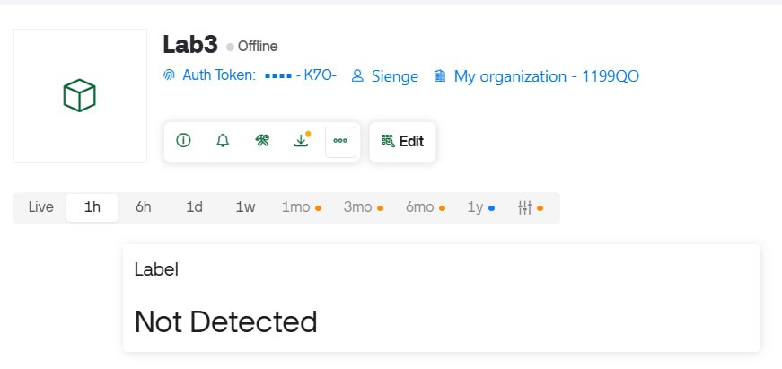
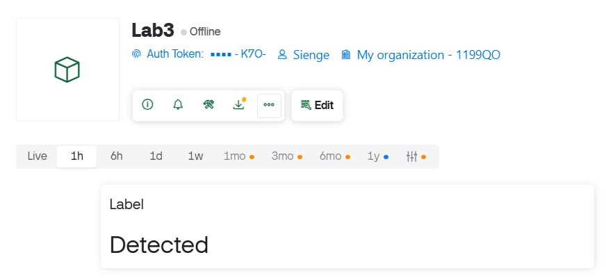

# LAB 3: IoT Smart Gate Control with Blynk, IR Sensor, Servo Motor, and TM1637

## Overview

This project implements an ESP32-based IoT smart gate control system using MicroPython and the Blynk platform. The system integrates multiple components to create an automated gate control mechanism with both automatic and manual operation modes.

### Key Features
- **Automatic Object Detection**: IR sensor detects objects and triggers gate opening
- **Remote Control**: Blynk mobile app for real-time monitoring and manual control
- **Local Display**: TM1637 7-segment display shows detection counter
- **Dual Control Modes**: Automatic IR-based control and manual override mode
- **Event Counting**: Tracks and displays the number of detection events

## System Components

## Hardware
- **ESP32 Development Board**: Main microcontroller
- **IR Sensor**: Digital object detection
- **Servo Motor (SG90)**: Gate actuation mechanism
- **TM1637 Display**: 7-segment display for local feedback
- **Connecting wires and breadboard**

### Software
- **MicroPython**: Firmware running on ESP32
- **Blynk IoT Platform**: Cloud-based control and monitoring
- **TM1637 Library**: Display driver

## Pin Connections

Configure the following connections on your ESP32. You may adjust GPIO pins as needed, but ensure you update the pin numbers in the code accordingly.

### TM1637 Display
- **GND** → GND
- **VCC** → 5V
- **DIO** → GPIO 16 (configurable in code)
- **CLK** → GPIO 17 (configurable in code)

### Servo Motor
- **Signal Wire** → GPIO 13 (configurable in code)
- **VCC** → 5V
- **GND** → GND

### IR Sensor
- **OUT** → GPIO 12 (configurable in code)
- **GND** → GND
- **VCC** → 5V

> **Note**: If you change any GPIO pins, make sure to update the corresponding pin numbers in your code files.

## Setup Instructions

### 1. Hardware Setup
1. Connect all components according to the pin connection diagram above
2. Ensure all power connections are secure
3. Verify that the IR sensor is positioned to detect objects in front of it

### 2. Software Setup

#### Install MicroPython on ESP32

#### Configure Blynk
1. Create a new Blynk template for ESP32
2. Add the following widgets:
   - LED widget for IR sensor status
   - Slider widget (0-180) for servo control
   - Value Display widget for detection counter
   - Switch widget for manual override mode
3. Update the Blynk credentials in each task file:
```python
   BLYNK_AUTH = 'your_auth_token_here'
```

#### Configure WiFi
Update WiFi credentials in each task file:
```python
WIFI_SSID = 'your_wifi_ssid'
WIFI_PASS = 'your_wifi_password'
```

### 3. Upload Code
1. Connect ESP32 to your computer via USB
2. Use Thonny IDE or ampy to upload the desired task file
3. Reset the ESP32 to start execution

## Tasks & Evidence

### Task 1 – IR Sensor Reading
**Objective**: Read IR sensor digital output and display status on Blynk

**Implementation**:
- IR sensor reads digital values (0 = detected, 1 = not detected)
- Status text ("Detected" / "Not Detected") sent to Blynk Label widget
- Continuous polling with short intervals
- Requires WiFi connection for Blynk communication

**Evidence**: 

**No Detection:**



**Object Detected:**



---

### Task 2 – Servo Motor Control via Blynk
**Objective**: Manual servo control using Blynk slider (0-180 degrees)

**Implementation**:
- Blynk slider widget controls servo position (0-180 degrees)
- Servo controlled via PWM on configured GPIO pin
- Real-time position updates from Blynk cloud
- Polling interval for smooth operation

**Evidence**: [Demo Video](https://youtube.com/shorts/pVEnq4W0P-g?si=V_A-csCypqJEi3d_)

---

### Task 3 – Automatic IR-Servo Action
**Objective**: Automatic gate opening when object is detected

**Implementation**:
- IR sensor triggers automatic servo movement when object detected
- Servo rotates to open position (90°)
- Short delay in open position
- Servo returns to closed position (0°)
- Cooldown period prevents double-triggering
- Standalone operation

**Evidence**: [Demo Video](https://youtube.com/shorts/upZJtCZ5PXw?si=l4uBqP1ozvn4iqsA)

---

### Task 4 – TM1637 Display Integration
**Objective**: Count and display detection events

**Implementation**:
- Counter increments on each IR detection event
- TM1637 display shows current counter value
- Display updated using TM1637 library methods
- Counter value synced to Blynk Value Display widget
- Debounce delay prevents multiple counts from single object
- Requires WiFi connection for Blynk updates

**Evidence**: [Demo Video](https://youtube.com/shorts/A_FAdYOKilc?si=R2tx6DSzDrMhFYf9)

---

### Task 5 – Manual Override Mode
**Objective**: Implement manual override to disable automatic IR control

**Implementation**:
- Blynk switch widget controls operating mode (Auto/Manual)
- **Auto Mode**: IR sensor active, servo opens automatically when object detected
- **Manual Mode**: IR sensor ignored, servo controlled by slider widget
- Servo angle constrained to safe range (0-180°)
- Mode status can be monitored via serial output
- Regular polling interval for responsive mode switching

**Evidence**: [Demo Video](https://youtu.be/Tcq1IgxKlTI?feature=shared)

---

## Usage

### Automatic Mode
1. Power on the ESP32
2. Set the mode switch to **Auto** in Blynk app
3. Place an object in front of the IR sensor
4. Observe the servo motor open automatically
5. Servo closes after a delay
6. Check the counter increment on both TM1637 and Blynk app (Task 4)

### Manual Mode
1. Set the mode switch to **Manual** in the Blynk app
2. Use the slider widget to manually control servo position (0-180°)
3. IR sensor detections will be ignored in this mode
4. Servo responds to slider changes

## System Behavior

1. **IR Detection**: When an object comes within range, the IR sensor outputs a detection signal
2. **Servo Actuation**: In Auto mode, servo rotates to open position
3. **Counter Update**: Each detection increments counter, displayed on TM1637 and Blynk
4. **Auto Close**: After a delay, servo returns to closed position
5. **Cloud Sync**: Status updates sent to Blynk via HTTP requests
6. **Mode Switching**: Switch widget seamlessly toggles between Auto (IR-based) and Manual (slider-based) control

## Author

**[Group 9 - Spring 2026]**  
LAB3 - IoT Smart Gate Control with Blynk, IR Sensor, Servo Motor,
and TM1637

