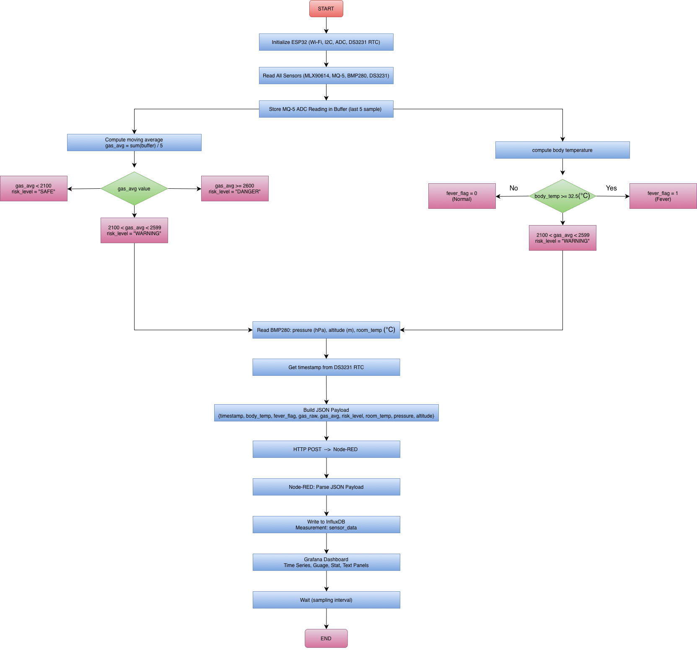
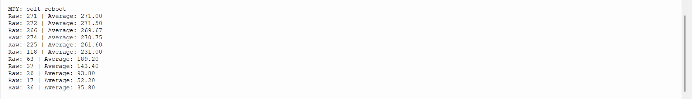
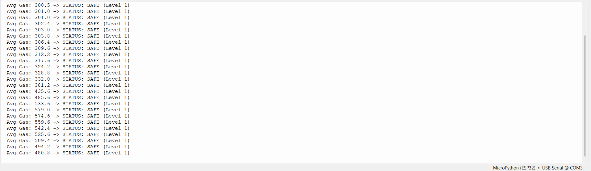
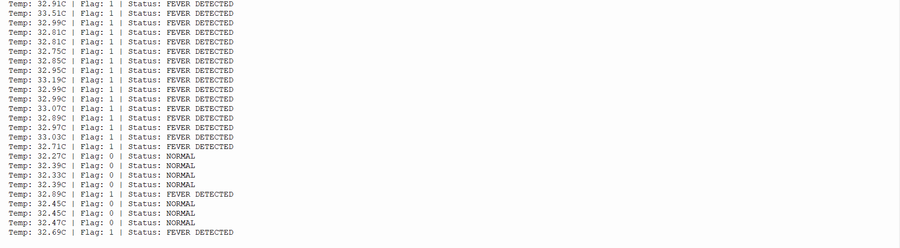
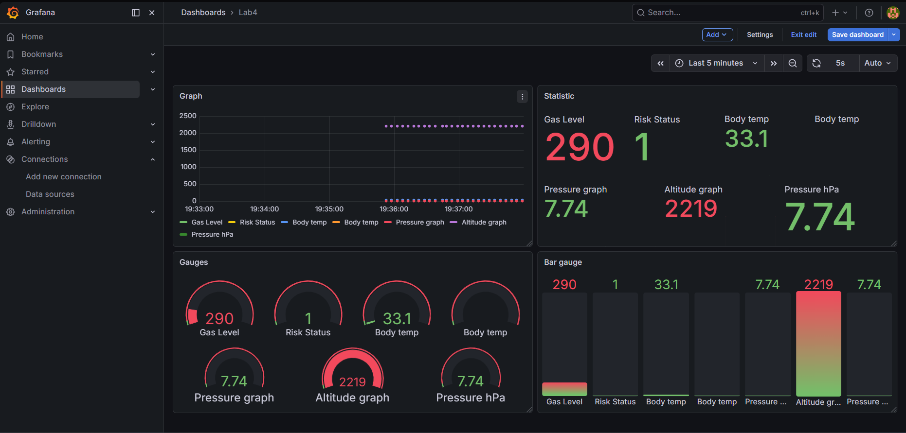
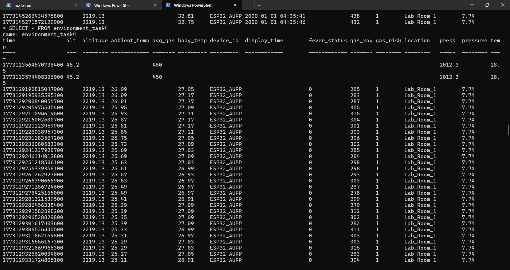

# LAB 4: Multi-Sensor IoT Monitoring with Grafana Dashboard

## 🎬 Demo Video

[](https://youtu.be/aJQIW_j-Ras)

> Click the thumbnail above to watch the full demo (60–90 seconds).

---

## Overview

This project implements a real-time multi-sensor IoT monitoring system using an **ESP32** microcontroller and **MicroPython**. The system integrates four hardware modules to collect environmental and health-related data, applies edge processing logic, and streams the results through an MQTT broker to a full data pipeline ending in a **Grafana** dashboard.

---

## System Architecture

```
[ESP32 Sensors] → [MQTT / HiveMQ] → [Node-RED] → [InfluxDB] → [Grafana]
```

| Layer | Component | Role |
|---|---|---|
| **Perception** | ESP32 + MQ-5, BMP280, DS3231, MLX90614 | Sensor data acquisition |
| **Transport** | WiFi + MQTT (HiveMQ Broker) | Wireless data transmission |
| **Processing** | Node-RED Function Nodes | JSON parsing & InfluxDB injection |
| **Application** | InfluxDB + Grafana | Storage & visualization |

### System Flowchart



---

## Hardware & Wiring

| Sensor | Interface | ESP32 Pins |
|---|---|---|
| BMP280 (pressure, altitude, temperature) | I2C | SDA → D21, SCL → D22, VCC → 3.3V |
| MLX90614 (IR body temperature) | I2C | SDA → D21, SCL → D22, VIN → 5V |
| DS3231 (RTC timestamp) | I2C | SDA → D21, SCL → D22, VCC → 5V |
| MQ-5 (gas / LPG sensor) | Analog (ADC) | A0 → D33, VCC → 3.3V |

> ⚠️ **Note:** BMP280 uses 3.3V. MLX90614 and DS3231 use 5V. Do **not** power BMP280 at 5V — it will burn the sensor.

---

## Features & Edge Processing Logic

### Task 1 — Gas Filtering (Moving Average)

The MQ-5 analog sensor produces noisy ADC readings (12-bit, 0–4095). A sliding window smooths the signal before use.

```python
WINDOW = 5
readings = []

def moving_average(val):
    readings.append(val)
    if len(readings) > WINDOW:
        readings.pop(0)
    return sum(readings) / len(readings)
```

- Stores the last **5** ADC samples.
- Computes the average to reduce noise.
- Both raw and averaged values are included in the MQTT payload.

**Evidence — Serial Monitor (Raw vs. Averaged):**



---

### Task 2 — Gas Risk Classification

Averaged gas readings are classified into three risk levels:

| ADC Average | Risk Level | Numeric Code |
|---|---|---|
| < 2100 | `SAFE` | 1 |
| 2100 – 2599 | `WARNING` | 2 |
| ≥ 2600 | `DANGER` | 3 |

```python
def classify(avg):
    if avg < 2100:
        return "SAFE", 1
    elif avg < 2600:
        return "WARNING", 2
    else:
        return "DANGER", 3
```

The numeric code (`gas_risk`) is included in the MQTT payload for Grafana threshold visualization.

**Evidence — Risk Classification States:**



---

### Task 3 — Fever Detection Logic

The MLX90614 measures non-contact object (body) temperature. A fever flag is derived:

```python
FEVER_THRESHOLD = 32.5  # °C

def fever_detect(body_temp):
    return 1 if body_temp >= FEVER_THRESHOLD else 0
```

- `fever = 1` → Fever detected
- `fever = 0` → Normal

> This threshold is calibrated for non-contact IR measurement (lower than clinical oral temperature).

**Evidence — Fever Detection Output:**



---

### Task 4 — Full Integration & Grafana Visualization

All processed fields are packed into a JSON payload and published every **5 seconds** via MQTT.

**MQTT Topic:** `/aupp/esp32/environment`  
**Broker:** `broker.hivemq.com:1883`

**Example Payload:**
```json
{
  "time_str": "2026-03-10 22:15:30",
  "gas_raw": 1850,
  "gas_risk": 1,
  "body_temp": 33.1,
  "fever": 1,
  "ambient_temp": 27.4,
  "pressure": 1013.25,
  "altitude": 12.5
}
```

---

## Node-RED Pipeline

The Node-RED flow consists of:

1. **MQTT In** — subscribes to `/aupp/esp32/environment`
2. **JSON node** — parses the incoming string payload
3. **Function node (Splitter)** — restructures fields for InfluxDB
4. **InfluxDB Out** — writes to measurement `environment_task4` in database `lab4_dbsq`
5. **Debug node** — monitors raw payload in the sidebar

**Function Node Logic (`Splitter`):**
```javascript
var data = JSON.parse(msg.payload);
msg.measurement = "environment_task4";
msg.payload = [{
    display_time: data.time_str,
    gas_raw: data.gas_raw,
    pressure: data.pressure,
    altitude: data.altitude,
    gas_risk: data.gas_risk,
    body_temp: data.body_temp
}, {
    device_id: "ESP32_AUPP",
    location: "Lab_Room_1"
}];
return msg;
```

The second object in the array is treated as **tags** by the InfluxDB node, enabling filtering in Grafana queries.

---

## Grafana Dashboard

The dashboard uses InfluxDB as its data source with the following panels:

| Panel | Type | InfluxQL Query |
|---|---|---|
| Gas Average | Time Series | `SELECT last("gas_raw") FROM "environment_task4" WHERE $timeFilter` |
| Risk Level | Stat / Gauge | `SELECT last("gas_risk") FROM "environment_task4" WHERE $timeFilter` |
| Body Temperature | Gauge | `SELECT last("body_temp") FROM "environment_task4" WHERE $timeFilter` |
| Pressure | Time Series | `SELECT last("pressure") FROM "environment_task4" WHERE $timeFilter` |
| Altitude | Time Series | `SELECT last("altitude") FROM "environment_task4" WHERE $timeFilter` |
| Timestamp | Stat (Text) | `SELECT last("display_time") FROM "environment_task4" WHERE $timeFilter` |

**Grafana Dashboard Screenshot:**



**InfluxDB Data Screenshot:**



---

## Project File Structure

```
lab_4/
├── main.py            # Main MicroPython program for ESP32
├── flows.json         # Node-RED flow export
├── images/
│   ├── grafana.png    # Grafana dashboard screenshot
│   ├── influxdb.png   # InfluxDB data screenshot
│   ├── task1.png      # Task 1 evidence (serial monitor)
│   ├── task2.png      # Task 2 evidence (risk classification)
│   └── task3.png      # Task 3 evidence (fever detection)
└── README.md          # This file
```

---

## How to Run

### 1. Upload Libraries to ESP32

Ensure the following MicroPython driver files are present on the ESP32 filesystem:

- `mlx90614.py`
- `bmp280.py`
- `ds3231.py`

Use **Thonny IDE** to upload files via the device file manager.

### 2. Configure Network Credentials

Open `main.py` and update:

```python
SSID = "your_wifi_ssid"
PASSWORD = "your_wifi_password"
```

### 3. Start Backend Services

```bash
# Start InfluxDB (default port 8086)
influxd

# Start Node-RED
node-red
```

Then import `flows.json` into Node-RED via **Menu → Import → Clipboard**.

### 4. Run the ESP32 Program

Open `main.py` in **Thonny** and press **Run (F5)**.  
Monitor the serial output to confirm sensor readings and MQTT publishing.

### 5. View the Dashboard

Open **Grafana** (default: `http://localhost:3000`) and navigate to the Lab 4 dashboard to view real-time data.

---

## Dependencies

| Component | Version / Notes |
|---|---|
| MicroPython | v1.20+ recommended |
| Thonny IDE | For flashing and running code |
| Node-RED | With `node-red-contrib-influxdb` v0.7.0 |
| InfluxDB | v1.x (database: `lab4_dbsq`) |
| Grafana | Any recent version |
| HiveMQ Broker | Public broker, no auth required |

---

## Authors

**AUPP IoT Lab — Lab 4 Submission**  
American University of Phnom Penh
