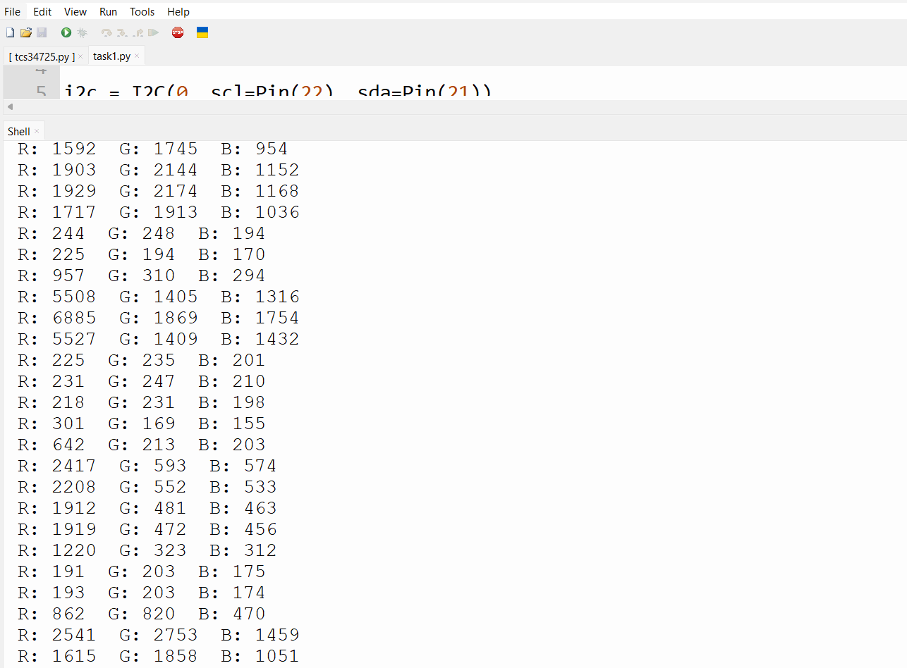
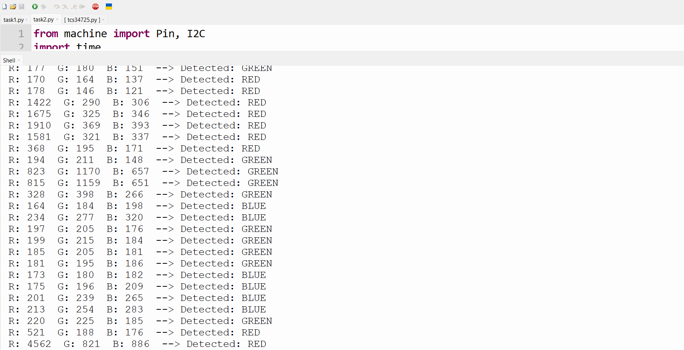
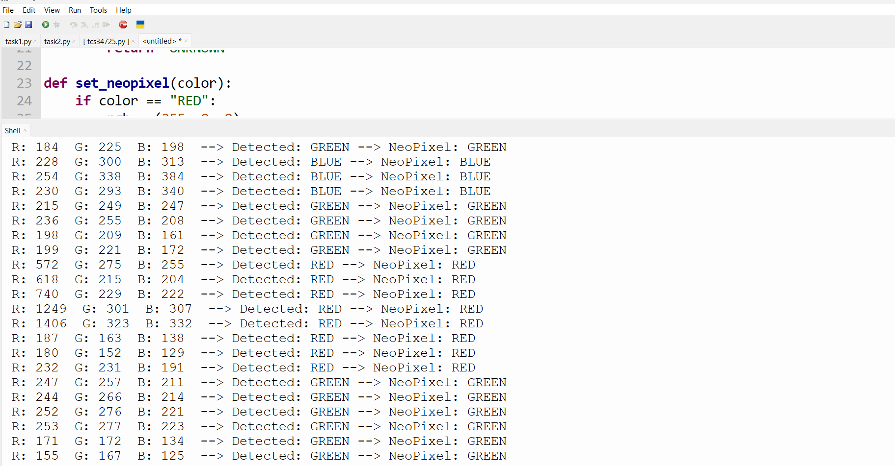
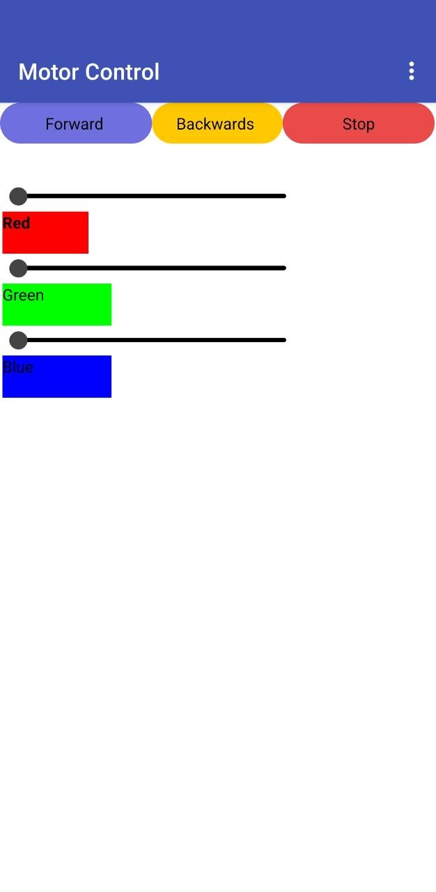

# LAB 5: Smart Color Detection & Control with MIT App

## Overview

This project implements a real-time color detection and control system using an ESP32 microcontroller and MicroPython. The system integrates a TCS34725 color sensor, a NeoPixel RGB LED, and a DC motor. Edge logic classifies detected colors and controls hardware outputs accordingly. A MIT App Inventor mobile app enables real-time monitoring and manual override control.

## System Architecture

```
[TCS34725 Sensor] → [ESP32 Edge Logic] → [NeoPixel + DC Motor]
                          ↕
                   [MIT App Inventor]
                   (Bluetooth / WiFi)
```

| Layer | Component | Role |
|---|---|---|
| Perception | ESP32 + TCS34725 | RGB color data acquisition |
| Processing | ESP32 MicroPython Logic | Color classification & PWM calculation |
| Actuation | NeoPixel LED + DC Motor | Visual and mechanical output |
| Application | MIT App Inventor | Mobile monitoring & manual control |

---

## Hardware & Wiring

| Component | Interface | ESP32 Pins |
|---|---|---|
| TCS34725 (color sensor) | I2C | SDA → D21, SCL → D22, VCC → 3.3V |
| NeoPixel RGB LED | Digital | DATA → D4, VCC → 5V |
| DC Motor (via driver) | PWM | PWM → D33, VCC → 5V |

> ⚠️ **Note:** TCS34725 operates at 3.3V. Do **not** power it at 5V — it will damage the sensor. Ensure the motor driver is properly grounded with the ESP32.

---

## Features & Edge Processing Logic

### Task 1: RGB Reading

The TCS34725 reads raw RGB channel values over I2C. Values are printed to the serial monitor for debugging and calibration.

```python
import machine
from tcs34725 import TCS34725

i2c = machine.SoftI2C(scl=machine.Pin(22), sda=machine.Pin(21))
sensor = TCS34725(i2c)

r, g, b, c = sensor.read()
print(f"R: {r}  G: {g}  B: {b}  Clear: {c}")
```

- Reads four channels: Red, Green, Blue, and Clear (ambient).
- Clear channel is used for normalization if needed.

**Evidence — Serial Monitor (RGB Output):**



---

### Task 2: Color Classification

Raw RGB values are compared channel-by-channel to determine the dominant color:

| Condition | Detected Color |
|---|---|
| R > G and R > B | RED |
| G > R and G > B | GREEN |
| B > R and B > G | BLUE |

```python
def classify_color(r, g, b):
    if r > g and r > b:
        return "RED"
    elif g > r and g > b:
        return "GREEN"
    elif b > r and b > g:
        return "BLUE"
    else:
        return "UNKNOWN"
```

The classified label is used by all downstream tasks (NeoPixel, motor, app).

**Evidence — Color Classification States:**



---

### Task 3: NeoPixel Control

The NeoPixel LED is updated to reflect the detected color. Only the first pixel is used.

| Detected Color | NeoPixel Output |
|---|---|
| RED | (255, 0, 0) |
| GREEN | (0, 255, 0) |
| BLUE | (0, 0, 255) |

```python
from machine import Pin
from neopixel import NeoPixel

np = NeoPixel(Pin(4), 1)

def set_neopixel(color):
    color_map = {
        "RED":   (255, 0, 0),
        "GREEN": (0, 255, 0),
        "BLUE":  (0, 0, 255),
    }
    np[0] = color_map.get(color, (0, 0, 0))
    np.write()
```

**Evidence — NeoPixel Color Change Demonstration:**



---

### Task 4: Motor Control (PWM)

The DC motor speed is adjusted via PWM based on the classified color. Higher PWM duty cycle corresponds to higher motor speed.

| Detected Color | PWM Duty Cycle |
|---|---|
| RED | 700 |
| GREEN | 500 |
| BLUE | 300 |

```python
from machine import Pin, PWM

motor_pwm = PWM(Pin(33), freq=1000)

def set_motor_speed(color):
    speed_map = {
        "RED":   700,
        "GREEN": 500,
        "BLUE":  300,
    }
    duty = speed_map.get(color, 0)
    motor_pwm.duty(duty)
```

**Evidence — Motor Speed Variation:**

[task 4 - Motro Control](https://youtu.be/IYlxtvFBA2Y)

---

### Task 5: MIT App Integration

The MIT App Inventor mobile app connects to the ESP32 and provides:

- **Color Display Label** — shows the currently detected color string.
- **Motor Control Buttons** — Forward, Stop, Backward.
- **RGB Input Boxes** — manual R, G, B value entry.
- **Set NeoPixel Button** — applies manual RGB color to the NeoPixel.

#### App → ESP32 Communication

The app sends commands over Bluetooth (or WiFi Serial) as formatted strings:

| App Action | Command Sent |
|---|---|
| Forward button | `MOTOR:FWD` |
| Stop button | `MOTOR:STOP` |
| Backward button | `MOTOR:BWD` |
| Set NeoPixel (R,G,B) | `NEO:R,G,B` |

#### ESP32 Command Handler

```python
def handle_command(cmd):
    if cmd == "MOTOR:FWD":
        motor_pwm.duty(700)
    elif cmd == "MOTOR:STOP":
        motor_pwm.duty(0)
    elif cmd == "MOTOR:BWD":
        # Reverse direction via motor driver logic
        pass
    elif cmd.startswith("NEO:"):
        r, g, b = map(int, cmd[4:].split(","))
        np[0] = (r, g, b)
        np.write()
```

**Evidence — MIT App Screenshot:**



---

## System Flowchart

```
Start
  │
  ▼
Read RGB from TCS34725
  │
  ▼
Classify Color (RED / GREEN / BLUE)
  │
  ├──→ Set NeoPixel Color
  ├──→ Set Motor PWM Speed
  └──→ Send Color String to MIT App
          │
          ▼
   MIT App Manual Override?
          │
     Yes  ▼
   Handle Motor / NeoPixel Command
          │
          ▼
        Loop
```

---

## How to Run

### 1. Upload Libraries to ESP32

Ensure the following MicroPython driver files are present on the ESP32 filesystem:

- `tcs34725.py`
- `neopixel.py` *(built-in on most MicroPython builds)*

Use **Thonny IDE** to upload files via the device file manager.

### 2. Configure Connection

For Bluetooth control, pair the ESP32's Bluetooth module with the MIT App.  
For WiFi control, update `main.py` with your credentials:

```python
SSID = "your_wifi_ssid"
PASSWORD = "your_wifi_password"
```

### 3. Run the ESP32 Program

Open `main.py` in Thonny and press **Run (F5)**.  
Monitor the serial output to confirm RGB readings and color classifications.

### 4. Launch the MIT App

Install the `.apk` on your Android device (or use the MIT AI2 Companion app).  
Connect to the ESP32 and verify:
- Color label updates automatically.
- Motor responds to Forward / Stop / Backward buttons.
- NeoPixel responds to manual RGB input.

---

## File Structure

```
lab5/
├── main.py              # Main loop: sensor read, classify, control
├── tcs34725.py          # TCS34725 I2C driver
├── color_logic.py       # Classification and output control functions
├── app/
│   └── lab5_app.aia     # MIT App Inventor project file
└── README.md
```

---

## Authors

**Group 9 — Spring 2026**  
LAB 5 — Smart Color Detection & Control with MIT App